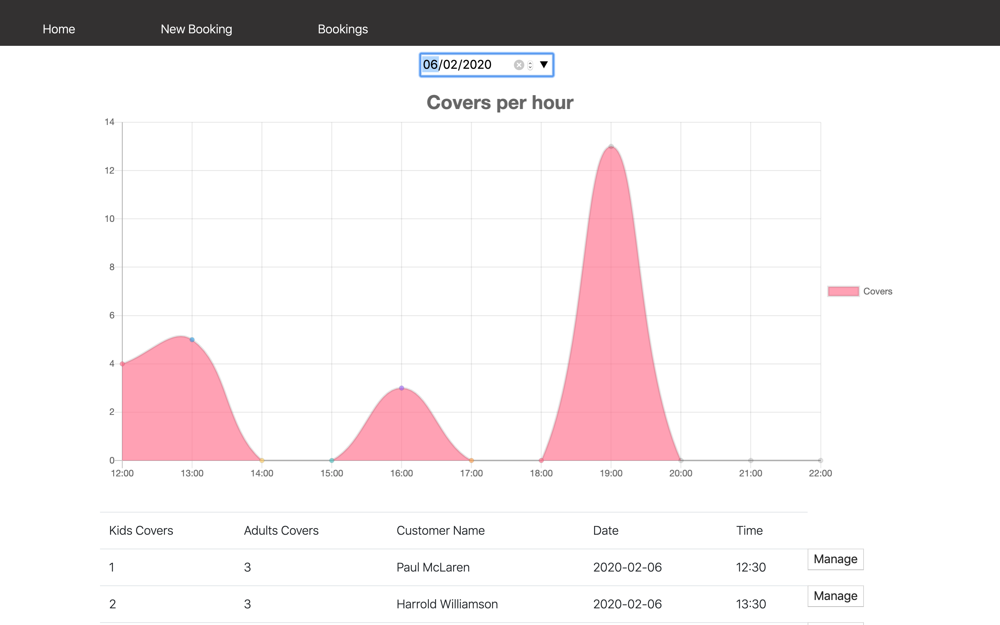

# Restaurant Booking System

This was my second group project as part of the CodeClan Professional Software Development course. A small team of four worked over three days to build the app using a React/JavaScript front end and Java/Spring back end with a psql database.
The app allows restarant staff to add new customers, create bookings with either existing or new customers, has a chart to display total covers for every hour on a specific date and a show page for bookings where booking details can be edited or bookings can be deleted.

## Get the app running

To set up the database(you will need PostgreSQL installed), run the following in the command line from anywhere on your system:

createdb -d restaurantbookingservice

Through an IDE (we used IntelliJ to for this project), open the project from the server directory(containing the pom.xml file).

Then run the RestaurantBookingSystemApplication file. 
You can find it here /server/src/main/java/com/example/restauranBookingSystem/restaurantBookingSystem

This will populate the database and start the backend running.

Then in the client directory, from the command line type:

npm install

then:

npm start

This should open the app in a browser window and you should be up and running.

---
### The Original Brief
### Restaurant Booking System:
You have been tasked to create a booking system for a brand new restaurant. The restaurant needs a way to book and arrange tables for customers who are booking over the phone. This system is for the staff to use.

#### MVP:
* Your system must be able to:
* Allow a customer to book a table at the restaurant for a particular time and date
* Update a booking, for example if the customer wants to change a booking time
* Display a list of bookings for a given date
* Display a list of customers ordered by frequency of visits

---